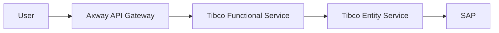
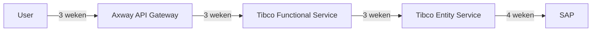
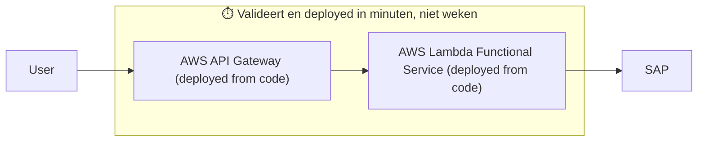
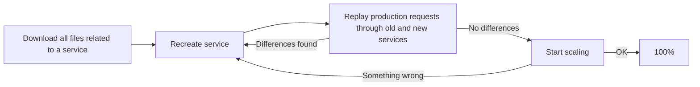

---
# try also 'default' to start simple
theme: seriph
# random image from a curated Unsplash collection by Anthony
# like them? see https://unsplash.com/collections/94734566/slidev
background: https://images.unsplash.com/photo-1737644467636-6b0053476bb2?q=80&w=2572&auto=format&fit=crop&ixlib=rb-4.1.0&ixid=M3wxMjA3fDB8MHxwaG90by1wYWdlfHx8fGVufDB8fHx8fA%3D%3D
# some information about your slides (markdown enabled)
title: Agentic Engineering Workshop
class: text-center
# https://sli.dev/features/drawing
drawings:
  persist: false
# slide transition: https://sli.dev/guide/animations.html#slide-transitions
transition: slide-left
# enable Comark Syntax: https://comark.dev/syntax/markdown
comark: true
# duration of the presentation
duration: 35min
---

# Agentic Engineering masterclass

## Harvest

25-09-2026

---
layout: two-cols
---

# Introductie

- Koen Griffioen
- Software Engineering Consultant @ BBTG
- "Quality Assurance Engineer" @ Eneco
- Privé
  - Getrouwd, dochter van 2,5
  - Gamer
  - Muziekliefhebber
  - Ik ren
- Achtergrond
  - Master Computer Science (Leiden)
  - 3 jaar Capgemini als Consultant en trainer
  - (over 6 dagen) 6 jaar in dienst bij NAVARA / BBTG

::right::

<div class="flex items-center justify-center h-full">
  
</div>

---

# Mijn reis tot zover
- Capgemini
  - Frontends, Angular
  - Backend, C# / .NET
  - Trainer voor Software Engineering (Full-stack, Java)
- via NAVARA @Essent
  - Frontend (Angular) 2022-2024
  - Backend (AWS serverless) 2024-2025
  - Durability (Temporal) 2025-2026
- Via NAVARA @Eneco
  - "Quality Assurance Engineer" in een OT team
  - Megabatterijen
- Trainer


---
layout: two-cols
---

# Essent - oorspronkelijke situatie
Van hopeloos verouderde integratie naar een TypeScript monorepo

- Axway => Tibco low-code => SAP
- TypeScript frontends in monorepo
- "Doet ie het wel of doet ie het niet"

::right::

<div class="flex items-center justify-center h-full">
  
</div>

---

# Essent - oorspronkelijke situatie
Van hopeloos verouderde integratie naar een TypeScript monorepo



"Oeps, er is iets misgegaan"

---
transition: slide-up
---

# Doorlooptijd per wijziging



- Axway API: **3 weken**
- Tibco Functional Service: **3 weken**
- Tibco Entity Service: **3 weken**
- SAP: **4 weken**
- **Totaal: 13 weken** voor een end-to-end wijziging

---

# Essent - onbereikbaar?

<div class="flex items-center justify-center h-full">
  
</div>

---
layout: two-cols
---

# Enter NAVARA

- PoC met MonoRepo platform + AWS Serverless deployments
- Doorlooptijden van < 30 minuten
- Monitoring out of the box
- Alerting out of the box
- Configuration as code
- "Eindeloze" schaalbaarheid
- Services as code => transparency
- Standardization of code
- Linting
- _Unit tests??_
- _Integration tests???_


---

# Nieuwe Architectuur



```ts
export const getCustomerV1 = async (id: string) => {
  await sapClient.connect();
  const result = await sapClient.getCustomer(id);
  const mapped = result.map((c) => ({ id: c.id, name: c.name }));
  return mapped;
};
```
---

# Operatie "Team Lambda"

Platform engineering

Service conversion flow

<v-click>


</v-click>

---

# Scale

- 150 services*
- 10 teams*
- 1,5 jaar
- 0% Tibco :)
- 100% TypeScript + AWS Serverless met tests


---

# Next step: workflows

DDD zit niet altijd mee

<v-clicks>

- Event-driven setup
- Geen observability
- Geen retries
- Complete chaos

</v-clicks>

<div v-click class="absolute inset-0 flex items-center justify-center">
  
</div>

---

<div class="absolute inset-0 flex items-center justify-center">
  
</div>

---
layout: two-cols
---

# Workshop

Agentic Orchestration workshop: Praten met een LLM

- Introductie op de repo
- Probleemstelling
- Korte demo
- Demo zonder Temporal als Durability platform
- Eerste opdrachtje
- Hackathon!

::right::

<div class="flex flex-col gap-2 items-center justify-center h-full">
  
  
  
</div>

---

# Timetable

| Tijd           | Onderdeel                            |
| -------------- | ------------------------------------ |
| 13:00 - 13:20  | Intro  **< Hier zijn we nu**         |
| 13:20 - 13:35  | Voorbeeld van agents zonder Temporal |
| 13:35 - 14:00  | Eerste opdrachtje                    |
| 14:00 - 14:15  | Pauze                                |
| 14:15 - 15:45  | Hackathon                            |
| 15:45 - 16:15  | Demos + wrap-up                      |
| 16:15 - donker | Borrel                               |

--- 

# Introductie repo

```
- api
- config
- frontend
- llm
- slides <-- deze slides
- temporal_app
- temporal_less_demo
```

---

# Praten met een LLM 101

Hoe pak je dat eigenlijk aan?

```
User:  "hey"
Agent: "hey, what can I do for you?"
User:  "wat is het weer in Utrecht?"
Agent: "zonnig, 18 graden"
```

Elke keer opnieuw naar de LLM:

```
<system prompt>
+ "Dit is al gezegd: user: hey | agent: hey, what can I do for you?
   | user: wat is het weer in Utrecht? | agent: zonnig, 18 graden"
+ <nieuwe user message>
```


---

# Todo

- ~~API Key fixen~~
- ~~Voorbereiding naar Harvest sturen~~
- Voorbeeld van agent zonder Temporal => Koen
- Refactor => Lars
- ~~Timetable~~
- Opdrachtvoorbeelden (praktisch)
  - Lars bereidt de eerste opdracht voor (uitwerking)
  - Aantal ideeen voor opdrachten bijplussen
- Hackathon voorbeelden / ideeen


